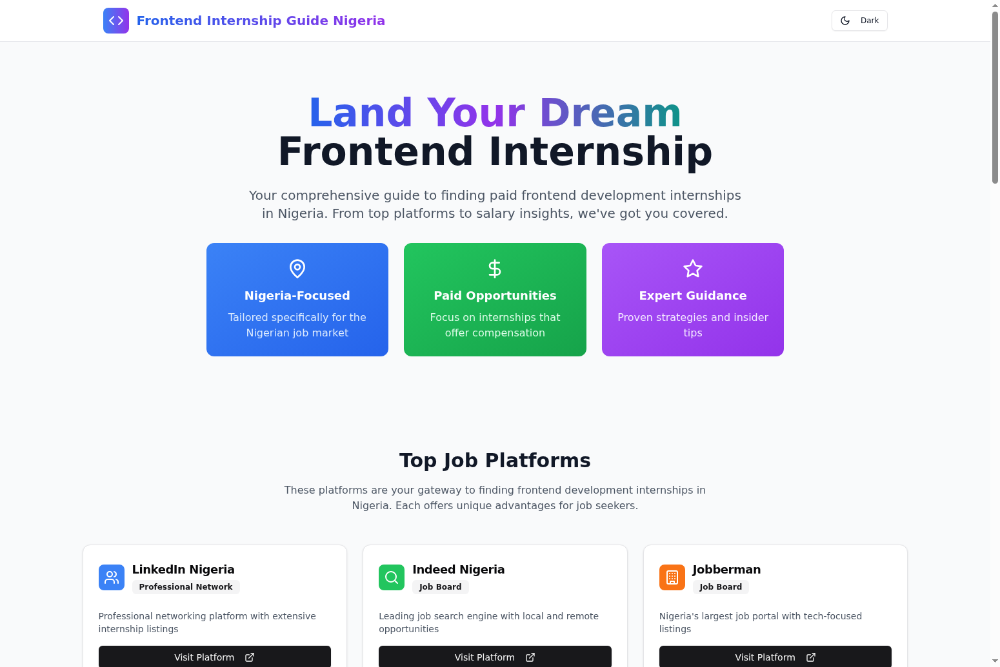

# 🚀 Frontend Internship Guide Nigeria

[](https://front-end-developer-job-search-nige.vercel.app/)



> 🎯 **Your comprehensive guide to landing paid frontend development internships in Nigeria**

A beautifully designed React application that provides Nigerian students and aspiring developers with curated resources, job platforms, company insights, and expert guidance for securing frontend development internships in the Nigerian tech ecosystem.

## ✨ Features

🇳🇬 **Nigeria-Focused Content** - Tailored specifically for the Nigerian job market with local insights and opportunities

💰 **Paid Opportunities** - Focus on internships that offer compensation, from ₦80K-₦400K locally to $1K-$3K for remote positions

⭐ **Expert Guidance** - Proven strategies and insider tips for successful job applications

🏢 **Top Companies** - Curated list of leading Nigerian and international companies hiring frontend interns

🔗 **Job Platforms** - Direct links to 6 major job platforms with frontend developer search filters

📱 **Responsive Design** - Beautiful, mobile-friendly interface with dark/light mode toggle

## 🛠️ Tech Stack

- **Frontend Framework:** React 18 ⚛️
- **Language:** TypeScript 📘
- **Build Tool:** Vite ⚡
- **Styling:** Tailwind CSS 🎨
- **Icons:** Lucide React + FontAwesome 🎯
- **UI Components:** Radix UI 🧩

## 🚀 Quick Start

### Prerequisites

Make sure you have the following installed:
- **Node.js** (version 18 or higher) 📦
- **npm** or **yarn** package manager 📋

### Installation

1. **Clone the repository**
   ```bash
   git clone https://github.com/raimonvibe/front-end-developer-job-search-nigeria.git
   cd front-end-developer-job-search-nigeria
   ```

2. **Install dependencies**
   ```bash
   npm install
   ```

3. **Start the development server**
   ```bash
   npm run dev
   ```

4. **Open your browser**
   
   Navigate to `http://localhost:5173` to view the application 🌐

## 📜 Available Scripts

| Command | Description | Usage |
|---------|-------------|-------|
| `npm run dev` | 🔥 Start development server with hot reload | Development |
| `npm run build` | 📦 Build production-ready application | Production |
| `npm run lint` | 🔍 Run ESLint for code quality checks | Code Quality |
| `npm run preview` | 👀 Preview production build locally | Testing |

## 📁 Project Structure

```
frontend-internship-guide-nigeria/
├── 📁 public/                 # Static assets
├── 📁 src/
│   ├── 📄 App.tsx            # Main application component
│   ├── 📄 main.tsx           # Application entry point
│   └── 📄 index.css          # Global styles with Tailwind
├── 📄 index.html             # HTML template
├── 📄 package.json           # Dependencies and scripts
├── 📄 tailwind.config.js     # Tailwind CSS configuration
├── 📄 tsconfig.json          # TypeScript configuration
└── 📄 vite.config.ts         # Vite build configuration
```

## 🎯 Key Sections

### 🏢 Top Job Platforms
- **LinkedIn Nigeria** - Professional networking with 39+ frontend developer jobs
- **Indeed Nigeria** - 75+ frontend developer opportunities
- **Jobberman** - Nigeria's largest job portal with 23+ frontend roles
- **NgCareers** - Nigerian career platform with graduate programs
- **Glassdoor Nigeria** - 85+ frontend developer jobs with salary insights
- **Wellfound** - Startup-focused platform with remote opportunities

### 🏆 Top Companies Hiring
- **Flutterwave** - Leading fintech (₦150K-₦300K)
- **Andela** - Global tech accelerator ($1K-$3K)
- **Google STEP** - Student Training in Engineering Program
- **MTN Nigeria** - Telecommunications leader (₦100K-₦250K)
- **Shell Nigeria** - Energy sector opportunities
- **Bincom ICT** - Local tech solutions provider

### 💡 Essential Skills
- HTML5/CSS3, JavaScript (ES6+)
- React.js, Vue.js, Angular
- Git/GitHub, Responsive Design
- REST APIs, Testing, Webpack

### 📈 Salary Expectations
- **Entry Level:** ₦80K - ₦150K
- **Intermediate:** ₦200K - ₦400K  
- **Remote International:** $1K - $3K

## 🎨 Design Features

- **Modern UI/UX** with gradient backgrounds and smooth animations
- **Dark/Light Mode** toggle for user preference
- **Responsive Design** that works on all devices
- **Interactive Cards** with hover effects and external links
- **Professional Typography** with clear information hierarchy

## 🤝 Contributing

We welcome contributions to improve the Frontend Internship Guide Nigeria! Here's how you can help:

1. **Fork the repository** 🍴
2. **Create a feature branch** (`git checkout -b feature/amazing-feature`)
3. **Commit your changes** (`git commit -m 'Add amazing feature'`)
4. **Push to the branch** (`git push origin feature/amazing-feature`)
5. **Open a Pull Request** 🚀

## 📝 License

This project is open source and available under the [MIT License](LICENSE).

## 👨‍💻 Author

**Raimon Baudoin**
- Website: [raimonvibe.com](https://raimonvibe.com)
- Email: info@raimonvibe.com
- GitHub: [@raimonvibe](https://github.com/raimonvibe)

## 🙏 Acknowledgments

- Nigerian tech community for inspiration and feedback
- All the companies and platforms featured in this guide
- Open source contributors and maintainers

---

<div align="center">

**⭐ Star this repository if it helped you land your frontend internship! ⭐**

Made with ❤️ for the Nigerian tech community

</div>
